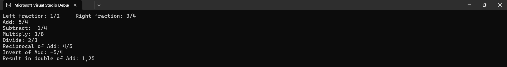
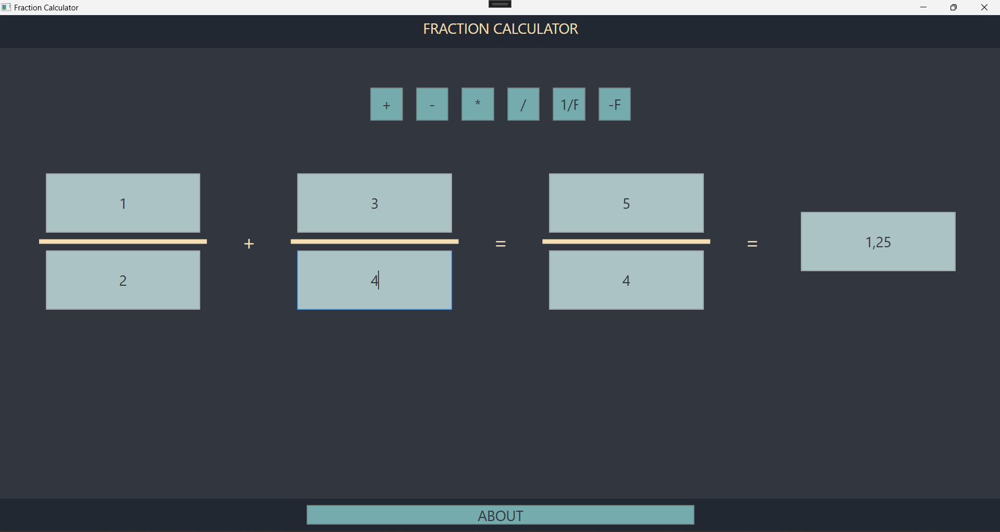
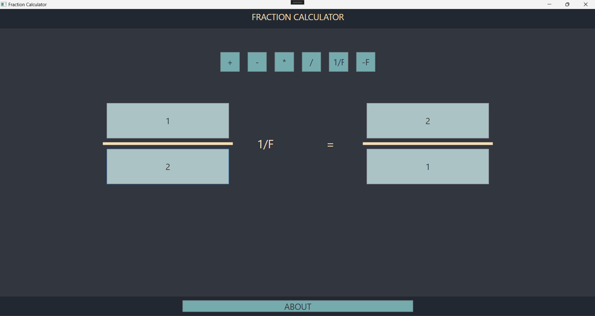
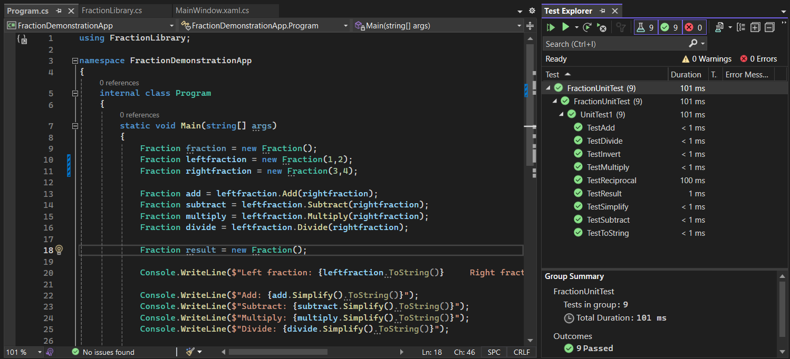
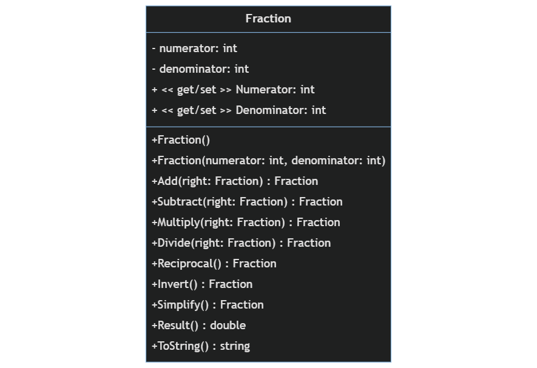

# Fraction Calculator

## Project description

This solution provides Fraction Library along with a console application and a WPF to get a user friendly view. The Fraction Library implements basic operations for calculations with fractions. There is a Unit test to check the correctness.

## Author

Joren Vandewalle
Student at Vives Brugge.

## Screenshots

### Console application with Fraction library

In the console you will see the 4 calculations with the left and right fraction. You also get the Reciprocal, Invert and the Result in double of the add result.

### Wpf window 

This is the Wpf window. This is a more user friendly style then something like the console.

## Setup and Usage

### Requirements

- Visual Studio

### Intructions

To use the Fraction Calculator, follow these steps:

1. Clone the repository or download the source code.
2. Open the solution in your Visual Studio.
3. Build the solution to restore the dependencies.
4. Run the console application or the WPF application.
5. Follow the instructions provided by the application to perform calculations with fractions.

## Unit test

This is an xUnit test framework. Here we test all the methods that you can use in the application. There are multiple test for 1 method. We test if it is correct whit all positive, negetive numbers and zeros.

## UML Class diagram of Fraction

This is the UML diagram we used for the Fraction Class.

## Future Improvements

- Being able to calculate more than 2 fractions.
- History and Memory functions.
- Graphical Representations (something like on a cake).
